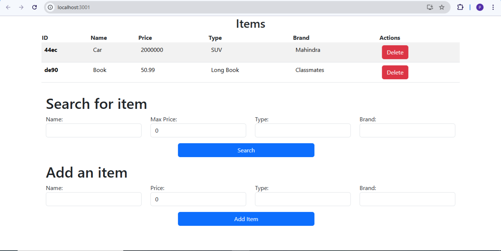

# Inventory-react
This project helped at understanding the basics of the React framework. The application allows users to add, search, and delete items in an inventory. It uses a JSON server for data persistence and is styled using Bootstrap.

# Dependencies Used
React: A JavaScript library for building user interfaces.

JSON Server: A full fake REST API for data persistence.

Bootstrap: A CSS framework for responsive, front-end development.

# Getting started
Ensure that Node.js is installed in your local machine.
Clone this repository and follow the instructions:

Install dependencies
```bash
npm install
```

Start json server
```bash
json-server db.json
```

Start the application
```bash
npm start
```

# Usage
Add Items: Use the provided form to add new items to the inventory.

Search Items: Utilize the search bar to filter and find items within the inventory.

Delete Items: Click the delete button next to any item to remove it from the inventory.

# ScreenShot

